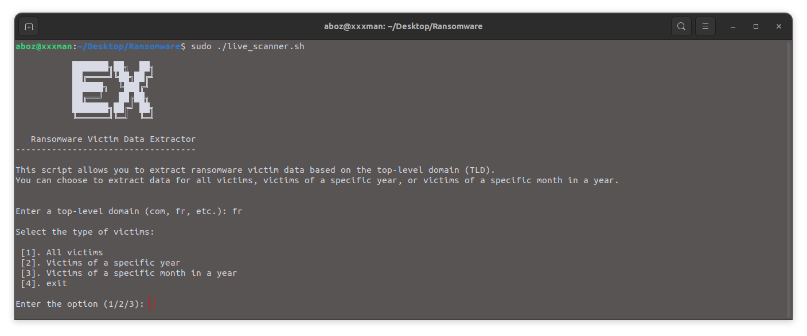

# Ransomware Victim Data Extractor

The **Ransomware Victim Data Extractor** is a Bash script that allows you to extract ransomware victim data based on the top-level domain (TLD). You can choose to extract data for all victims, victims of a specific year, or victims of a specific month in a year.


## Usage

To use the script, execute it from the command line:

```bash

./live_scanner.sh

```



## Requirements

These are the dependencies needed to run the script successfully.

# jq: 
A lightweight and flexible command-line JSON processor. Install with 
```bash

sudo apt-get install jq

```


# wget: 
A utility for non-interactive downloading of files from the web, Pre-installed on most Linux systems.


# curl: 
A command-line tool for transferring data with URLs. Pre-installed on most Linux systems.


# awk: 
A text processing tool for pattern scanning and processing. Pre-installed on most Linux systems.

